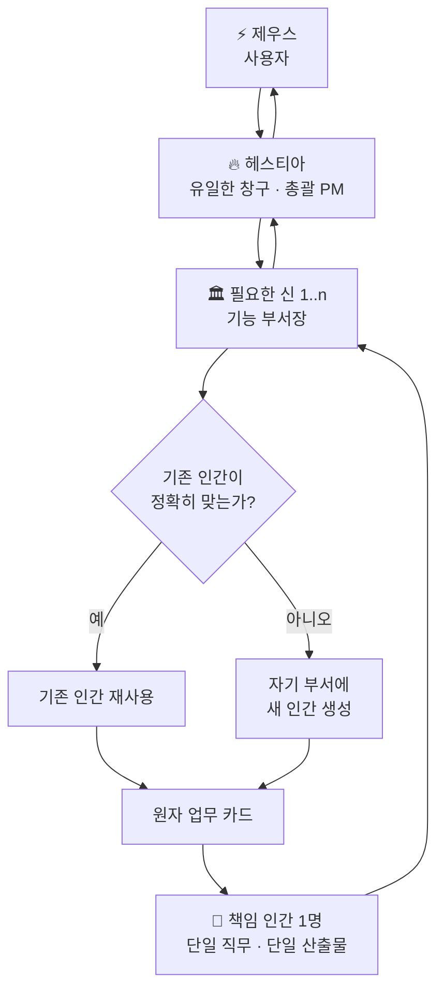
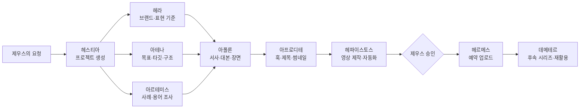

<div align="center">

# ⚡ OLYMPUS

### 신은 부서장이고, 인간은 그 부서의 손이다

**Grokbot을 출발점으로 설계한 계층형 멀티에이전트 운영 아키텍처**  
제우스가 목표를 말하면 헤스티아가 프로젝트를 조직하고, 신들이 전문 인간 에이전트를 배치해 결과를 만든다.

[](./OLYMPUS_Agent_Architecture_v0.4.md)
[](#-현재-상태)
[](#-공통-운영-규칙)
[](#-네-가지-프로젝트-라인)

[**전체 설계서 읽기**](./OLYMPUS_Agent_Architecture_v0.4.md) · [**핵심 원칙**](#-올림푸스-헌법) · [**신들의 조직표**](#-올림푸스-조직표)

</div>

---

## 🏛️ OLYMPUS란?

OLYMPUS는 여러 AI가 자유롭게 떠드는 스웜이 아니라, **명확한 지휘 계통과 책임 범위**를 가진 멀티에이전트 조직이다.

> **One Project, Many Gods, Many Hands, One Owner per Task.**  
> 프로젝트에는 여러 신과 인간이 참여할 수 있지만, 하나의 업무 카드에는 책임 인간이 한 명만 존재한다.

| 계층 | 구성원 | 역할 |
|---|---|---|
| 1층 | **제우스** | 사용자 본인. 목표·우선순위·최종 승인을 결정한다. |
| 2층 | **헤스티아** | 유일한 창구이자 총괄 PM. 요청을 프로젝트로 만들고 신들을 소집한다. |
| 3층 | **올림푸스의 신들** | 기능 부서장. 업무를 분해하고 자기 부서의 인간을 생성·배치·검수한다. |
| 4층 | **유명한 인간들** | 하나의 전문 직무만 수행하는 실행 에이전트다. |

명칭은 조직을 쉽게 기억하기 위한 메타포다. 봇들은 신화 연기를 하거나 고대 그리스식 말투를 사용하지 않는다.

---

## 🔱 운영 구조



```text
제우스 1
  ↓
헤스티아 1
  ↓
프로젝트당 신 1..n
  ↓
신마다 인간 0..n
  ↓
업무 카드마다 책임 인간 1
```

---

## 🎯 네 가지 프로젝트 라인

OLYMPUS는 현재 다음 네 가지 생산 활동을 다룬다. 신은 제품별 고정 팀이 아니라 기능 부서이므로, 프로젝트에 필요한 신만 선택적으로 참여한다.

| 프로젝트 라인 | 대표 결과물 | 주로 참여하는 신 |
|---|---|---|
| 🎬 **유튜브** | 숏츠, 롱폼, 대본, 장면 구성, 썸네일, 영상, 업로드 | 아테나 · 아르테미스 · 아폴론 · 아프로디테 · 헤파이스토스 · 헤르메스 |
| 💬 **이모티콘** | 캐릭터, 표정·동작 세트, 문구, 플랫폼 제출물 | 헤라 · 아테나 · 아폴론 · 아프로디테 · 디오니소스 · 헤르메스 |
| 💻 **웹·앱** | 웹서비스, 모바일 앱, 내부 도구, 자동화, 배포 | 아테나 · 아르테미스 · 헤파이스토스 · 포세이돈 · 아레스 |
| ✍️ **블로그** | 조사형 글, 설명형 글, 시리즈, 대표 이미지, 게시 | 아테나 · 아르테미스 · 아폴론 · 아프로디테 · 헤르메스 · 데메테르 |

---

## 👑 올림푸스 조직표

헤스티아를 포함한 12신 체계다. 헤스티아만 인간을 생성하지 않으며, 나머지 신들은 **자기 부서 범위 안에서만** 인간을 생성할 수 있다.

| 신 | 부서 레이블 | 핵심 책임 | 인간 생성 |
|---|---|---|:---:|
| **헤스티아** | 비서실장 | 창구, 프로젝트 구성, 배분, 통합 보고 | ❌ |
| **헤라** | 기준 | 품위, 브랜드 원칙, 일관성, 품질 게이트 | ✅ |
| **아테나** | 기획 | 목표, 구조, 요구사항, 우선순위 | ✅ |
| **아르테미스** | 리서치 | 조사, 추적, 출처, 사실 검증 | ✅ |
| **아폴론** | 정제 | 대본, 글, 서사, 내레이션, 장면 문서 | ✅ |
| **아프로디테** | 매력 | 톤, 훅, 썸네일, 캐릭터·UI 미감 | ✅ |
| **디오니소스** | 실험 | 파격안, 변주, 대안 실험 | ✅ |
| **헤파이스토스** | 개발 | 앱, 웹, 도구, 코드, 제작 자동화 | ✅ |
| **포세이돈** | 인프라 | 서버, 리눅스, 네트워크, 저장소, 업타임 | ✅ |
| **헤르메스** | 발행 | 전달, 예약, 게시, 릴리스, 배포 기록 | ✅ |
| **데메테르** | 수확 | 캘린더, 반복 생산, 재활용, 자산 축적 | ✅ |
| **아레스** | 장애 | 사고 분류, 격리, 복구. 평상시 루틴 금지 | ✅ |

각 신의 상세 프롬프트, 금지사항, 인간 슬롯 카탈로그는 [전체 설계서](./OLYMPUS_Agent_Architecture_v0.4.md)에 정의되어 있다.

---

## 👤 인간 에이전트 모델

인간은 유명인의 이름을 붙인 **단일 직무 실행 봇**이다. 이름은 역할을 기억하기 위한 상징적 라벨이며, 실제 인물을 사칭하거나 고유 문체·인격을 복제하기 위한 장치가 아니다.

### 생성 원칙

1. 신은 먼저 자기 부서의 기존 인간을 검색한다.
2. 직무와 입출력 계약이 정확히 맞으면 기존 인간을 재사용한다.
3. 맞는 인간이 없을 때만 새 인간을 생성한다.
4. 새 인간은 한 명의 부모 신과 한 가지 직무만 가진다.
5. 인간은 다른 인간이나 신을 호출하거나 새 인간을 만들 수 없다.

예를 들어 포세이돈은 리눅스 실행 환경 업무가 처음 발생했을 때 다음과 같은 인간을 만들 수 있다.

```yaml
human:
  human_id: POS-H001
  display_name: "리누스 토르발스"
  parent_god: POSEIDON
  slot_id: POSEIDON-LINUX-RUNTIME
  single_job: "리눅스 기반 실행 환경을 설계하고 점검한다"
  output: "환경 구성안 및 운영 명령"
  status: DORMANT
```

아폴론 아래에는 여러 인간이 함께 존재할 수 있다. 다만 같은 일을 중복 수행하지 않는다.

```text
아폴론
├─ 조앤 K. 롤링   → 이야기 구조
├─ 스티븐 스필버그 → 장면·연출 구성
└─ 대사 전문 인간   → 내레이션과 대사 정제
```

### 인간은 삭제하지 않는다

```text
DELETE_HUMAN = false
```

인간은 생성 후 기록에서 사라지지 않는다.

| 상태 | 의미 |
|---|---|
| `PROVISIONAL` | 첫 실제 업무를 위해 시험 생성됨 |
| `ACTIVE` | 현재 업무를 수행 중 |
| `DORMANT` | 등록되어 있으나 현재 쉬는 중 |
| `SUPERSEDED` | 새 인간 또는 새 역할 버전으로 대체됨 |
| `QUARANTINED` | 반복 오류나 위험 행동으로 사용 중지됨 |
| `ARCHIVED` | 장기 미사용이지만 이력으로 보존됨 |

직무가 달라지면 기존 인간을 억지로 확장하지 않는다. 기존 인간은 보존하고, 새로운 슬롯과 새로운 인간을 생성한다.

---

## 📜 올림푸스 헌법

<table>
<tr>
<td width="50%" valign="top">

### 01. 단일 창구
제우스는 헤스티아와만 대화한다. 모든 요청·수정·승인·보고가 헤스티아를 통과한다.

### 02. 다중 부서
헤스티아는 프로젝트에 필요한 여러 신을 소집하고 선후 관계와 병렬 실행을 관리한다.

### 03. 부서 내 생성
신은 자기 부서의 인간만 생성한다. 새로운 신이나 다른 부서의 인간은 만들 수 없다.

### 04. 기존 인간 우선
새 인간을 만들기 전에 동일한 직무를 가진 기존 인간이 있는지 반드시 확인한다.

</td>
<td width="50%" valign="top">

### 05. 단일 책임
프로젝트에는 여러 인간이 참여할 수 있지만, 업무 카드 하나에는 책임 인간이 한 명만 존재한다.

### 06. 인간의 재위임 금지
인간은 다른 인간을 부르거나 만들지 않는다. 범위를 벗어난 일은 부모 신에게 보고한다.

### 07. 삭제 금지
인간은 hard delete하지 않는다. 휴면·대체·격리·보관 상태로 이력을 유지한다.

### 08. 제우스 승인
외부 공개, 비용 발생, 운영 반영, 도메인 변경, 데이터 삭제 등 고위험 행위는 제우스 승인이 필요하다.

</td>
</tr>
</table>

---

## 🎬 유튜브 숏츠 처리 예시

제우스가 헤스티아에게 다음과 같이 요청한다고 가정한다.

> “SAP에서는 스탠다드라서 안 됩니다”를 풍자하는 유튜브 숏츠를 만들어줘.



이 과정에서 각 신은 필요한 인간을 하나 이상 배치할 수 있다. 그러나 각 인간에게는 서로 구분되는 원자 업무 카드가 전달된다.

---

## 🗣️ 공통 운영 규칙

모든 신과 인간은 다음 규칙을 상속한다.

- 모든 말과 보고는 한국어로 작성한다.
- 신화 연기, 신전·화산·전쟁식 캐릭터 말투를 사용하지 않는다.
- 코드, 파일명, 오류 로그, API 필드는 원문을 유지할 수 있다.
- 한 번에 한 업무 카드에 집중한다.
- 사실, 가정, 의견을 구분한다.
- 비밀키·비밀번호·복구 코드를 채팅으로 요구하지 않는다.
- 같은 실패를 두 번 반복하면 멈추고 막힌 지점을 보고한다.
- 기존 코드나 자산이 있으면 새로 만들기 전에 수정·재사용 가능성을 검토한다.

기본 보고 형식은 다음과 같다.

```text
Facts
- 확인된 사실

배분 / 산출물
- 신: 어떤 인간에게 어떤 업무를 배분했는가
- 인간: 어떤 결과를 만들었는가

승인대기
- 제우스 승인이 필요한 행위

막힌 지점
- 진행을 막는 문제

인계요청
- 다른 부서가 필요한 경우
```

---

## 📂 저장소 구성

```text
olympus_grokbot/
├── README.md
└── OLYMPUS_Agent_Architecture_v0.4.md
```

| 파일 | 설명 |
|---|---|
| [`README.md`](./README.md) | 프로젝트의 목적과 핵심 운영 원칙을 빠르게 확인하는 첫 화면 |
| [`OLYMPUS_Agent_Architecture_v0.4.md`](./OLYMPUS_Agent_Architecture_v0.4.md) | 조직 헌법, 권한 행렬, 인간 생성 프로토콜, 신별 프롬프트와 인간 슬롯을 담은 전체 설계서 |

---

## 🚧 현재 상태

현재 저장소는 **아키텍처 및 운영 규칙 설계 단계**다.

- [x] 제우스–헤스티아–신–인간 계층 정의
- [x] 12신의 기능 경계와 권한 정의
- [x] 인간 생성·재사용·보존 정책 정의
- [x] 유튜브·이모티콘·웹/앱·블로그 프로젝트 라인 정의
- [x] 신별 인간 슬롯 카탈로그 작성
- [ ] 신별 봇 프롬프트를 개별 파일로 분리
- [ ] 인간 레지스트리와 스키마 검증기 구현
- [ ] 헤스티아 라우터 및 의존성 그래프 구현
- [ ] 유튜브 프로젝트를 이용한 첫 종단간 파일럿

---

## 💡 설계 철학

```text
제우스는 목표를 말한다.
헤스티아는 프로젝트를 조직한다.
신들은 자기 부서를 운영한다.
인간들은 각자의 한 가지 일을 수행한다.
생성된 인간은 삭제하지 않는다.
```

<div align="center">

---

Designed by **[BoxLogoDev](https://github.com/BoxLogoDev)**  
상세한 규칙과 전체 인간 슬롯은 **[OLYMPUS 멀티에이전트 조직 설계서 v0.4](./OLYMPUS_Agent_Architecture_v0.4.md)**에서 확인할 수 있다.

</div>
