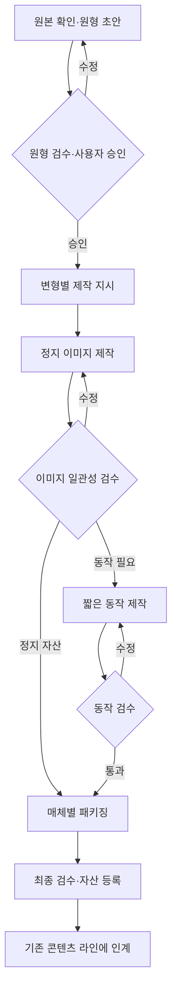

# 캐릭터 제작·확장 파이프라인

정책: [OLYMPUS v1.2](../OLYMPUS_Agent_Architecture_v1.2.md), `OLY-INV-022`, `OLY-CHR-001`  
프로젝트 라인: `CHARACTER` / 최초 캐릭터: [밤 (`BAM`)](../characters/bam/character.yaml)  
상태: 설계·계약 반영. 원형 확정·실제 이미지 제작·실행 시스템 검증은 아직 진행하지 않았다.

## 1. 목적과 범위

사용자가 그린 원화를 기준으로 캐릭터를 유지하면서 표정·직업·행동을 확장한다. 승인 자산은 이모티콘·유튜브·웹·앱·블로그에서 재사용한다. 캐릭터 원형과 매체별 제작 지시를 분리해 한 채널의 연출이 공통 원형을 덮어쓰지 않게 한다.

캐릭터 ID와 인간 ID는 별개다. `BAM-JOB-01` 개발자밤은 밤의 변형 자산이며 개발 업무를 맡는 AI 인간이 아니다. 새로운 직업·표정이 추가되어도 기존 실행자를 먼저 재사용한다. 모든 부서 간 인계는 헤스티아를 통한다.

## 2. 입력과 준비 조건

| 입력 | 필수 내용 | 없을 때 |
|---|---|---|
| 원본 자료 | 출처, 원본 파일명, SHA-256, 접근 가능한 보관 참조 | 파일 확인이 필요한 업무를 배정하지 않음 |
| 캐릭터 설정 | 이름, 유지 특징, 변형 범위, 미확인 항목 | 원형 명세 초안 작성 |
| 승인 원형 | 원형 ID·버전·해시, 기준 이미지 ID·버전·해시, 헤라 검수·제우스 승인 | 파생 제작의 READY 전환 차단 |
| 제작 지시 | 변형 ID, 표정·포즈·의상·행동, 배경, 산출 형식·크기 | 해당 지시를 먼저 작성 |
| 실행 준비 | 완전한 실행 템플릿, 등록 인간, 도구 권한, 비용·시간 한도 | 담당자·권한·예산 확보 전 DRAFT 유지 |
| 동작 입력 | 같은 원형을 참조한 검수 통과 정지 이미지, 동작 지시 | 애니메이션 제작 차단 |

이번 밤 설정의 `storage_ref: null`은 입력 파일을 실행 환경의 보관소에 연결해야 한다는 뜻이다. 파일명만으로 이미지를 읽었다고 간주하지 않는다. 실제 바이트를 읽어 기록된 해시와 대조한 후 보관 참조를 연결한다. 대화 첨부의 일시 경로나 접근 토큰을 공개 저장소에 넣지 않는다.

원본 이미지의 작성자는 사용자로 유지한다. 원본 등록 메타데이터, AI 작성 명세, 가공 파일의 작성자와 계보는 각각 기록한다. 원본 바이트는 보존하고 모든 편집본은 새 자산으로 저장한다.

## 3. 원형 확정

1. 데메테르의 `DEMETER-ASSET-LIBRARIAN`이 원본·얼굴 확대·전신·변형·영상 참고를 구분한다.
2. 아프로디테의 `APHRODITE-CHARACTER-CANON`이 원형 명세 초안을 작성한다. 정확한 색상·비율과 보이지 않는 측면·후면은 확인 전 확정하지 않는다.
3. 헤라의 `HERA-CONSISTENCY-AUDIT`이 후보 원화와 명세를 비교한다. 차이가 있으면 작성자에게 부위별 수정 요청을 반환한다.
4. 헤스티아가 검수 통과한 원형 명세와 기준 이미지를 제우스에게 제시한다. 제우스 승인 후 `APPROVED` 원형을 등록한다.

승인 대상은 `CHARACTER_CANON_APPROVE` 매니페스트에 묶는다. `character_id`, 원형 ID·버전·해시, 모든 기준 이미지 ID·버전·해시를 포함하고 공통 승인 정책의 전체 매니페스트 직렬화·해시·인증 이벤트 검증을 적용한다. 승인받은 원형이나 이미지가 달라지면 새 승인 대상이다. 승인 문자열을 파일에 직접 적는 것으로 승인 이벤트를 대체할 수 없다.

원형의 상태는 `DRAFT → IN_REVIEW → WAITING_APPROVAL → APPROVED`다. 반려되면 새 초안 버전으로 돌아가며 이전 검수·승인 이력은 남긴다. 원형을 교체할 때 기존 버전은 `SUPERSEDED`로 보존한다.

## 4. 제작 DAG

아래 화살표는 산출물 의존성이다. 실제 부서 간 전달은 헤스티아가 수행한다.

모든 수정 화살표는 공통 재시도 한도의 적용 대상이다. 수정본당 최초 포함 2회, 품질 수정 최대 2회, 전체 시도 최대 6회이며 같은 실패가 누적 2회면 자동 반복을 중단한다. 새 카드로 횟수를 초기화하지 않는다.

| 원자 업무 | 슬롯 | 산출물 |
|---|---|---|
| 캐릭터 원형 명세 | `APHRODITE-CHARACTER-CANON` | `CHARACTER_CANON_DRAFT` |
| 표정·포즈 지시 | `APHRODITE-EXPRESSION-DESIGNER` | 표정·포즈 매트릭스 |
| 장면·동작 지시 | `APOLLO-SCENE-DIRECTOR` | 승인된 대본을 참조한 샷 지시 |
| 정지 이미지 1개 | `HEPHAESTUS-CHARACTER-ILLUSTRATOR` | `CHARACTER_STILL` |
| 짧은 동작 1개 | `HEPHAESTUS-CHARACTER-ANIMATOR` | `CHARACTER_MOTION` |
| 일관성 검사 | `HERA-CONSISTENCY-AUDIT` | 부위별 비교·위반·통과 기록 |
| 이미지 규격화 | `HEPHAESTUS-IMAGE-PROCESSOR` | 크기·형식·이름을 맞춘 패키지 |
| 영상 조립 | `HEPHAESTUS-VIDEO-ASSEMBLER` | 영상·음성·자막의 조립본 |
| 완료 조건 검사 | `HERA-ACCEPTANCE-GATE` | 최종 검수 결정 |
| 자산 목록 등록 | `DEMETER-ASSET-LIBRARIAN` | 검색 가능한 자산 카탈로그 |

짧은 무대사 반응 동작은 표정·포즈 지시에 시작·종료 자세와 시간·반복 여부를 포함할 수 있다. 이야기·대사·여러 샷이 필요하면 아폴론의 대본 작성과 장면 연출을 별도 업무로 추가한다. 영상 조립자가 대본이나 기본 원형을 임의로 정하지 않는다.

직업·표정별 산출물은 각각 별도 업무 카드다. 같은 인간에게 여러 카드를 동시 배정하지 않는다. 원형 승인 업무의 대기와 무관한 규격 조사·목록 정리·초안 기획은 진행할 수 있다. 비용과 참조 이미지 지원을 확인한 도구를 업무별로 연결하며, 처음부터 별도 모델 학습을 필수 단계로 삼지 않는다.

## 5. 밤의 최초 기준과 파일럿

이름은 사용자 확인값 **밤**이다. 전신 `IMG_2892.png`와 얼굴 확대 `IMG_2895.jpeg`는 기준 원화 **후보**다. 초록 잎, 밤 모양 머리, 밝은 얼굴 아래 띠와 점무늬, 둥근 체형을 식별 특징 후보로 둔다. 반쯤 감긴 눈은 기본 표정이며 감정별 눈 모양 변화는 가능하다. 옷으로 가려진 배·껍질을 원형에서 삭제된 것으로 판단하지 않는다.

| 파일럿 순서 | 산출물 | 진행 조건 |
|---|---|---|
| 1 | 기본형 원형 명세와 기준 원화 승인 | 접근 가능한 전신·얼굴 자료와 헤라 검수 |
| 2 | 기본·기쁨·당황·분노·슬픔·피곤 표정 6종 | 승인 원형, 표정별 제작 지시, 이미지별 일관성 검수 |
| 3 | 개발자밤의 타이핑 준비 이미지 | `BAM-JOB-01` 참고 자료와 승인 원형 대조 |
| 4 | 개발자밤 타이핑 3~4초 반복 동작 1개 | 검수 통과 준비 이미지와 동작 지시 |
| 5 | 재사용 패키지·자산 카탈로그 | 투명도·규격·반복 경계·계보 검사 |

이 목록은 첫 제작 범위의 설계다. 담당 인간·도구·예산은 아직 배정되지 않았고 결과물은 생성되지 않았다. 36종 직업 자료는 참고 목록으로 등록했으며 제작·승인 완료 수량으로 집계하지 않는다.

첨부된 정지 이미지 9개는 1536×1024 RGB이며 알파 채널이 없다. 흰 배경과 스티커 테두리를 투명 배경으로 간주하지 않는다. 이미지 제작 담당이 배경 제거·개별 자산 분리 등 시각 편집을 수행하고, 헤라가 잎·얼굴·밝은 배·외곽선 손상을 확인한 후 이미지 처리 담당이 규격화한다. 플랫폼별 최종 크기·용량·프레임 조건은 목표 매체를 정한 뒤 아르테미스의 최신 규격 조사 결과에 고정한다.

`jagerbami.mp4`는 512×512, 30 fps, 약 3.8초의 병·캐릭터 결합 동작 참고다. 제품·상표 요소나 그 연출을 밤의 기본 원형으로 승격하지 않는다. 원본 영상 전체의 검수 없이 자연스러운 반복 동작이라고 확정하지 않는다.

## 6. 검수와 계보

일관성 검수는 기준 이미지와 결과를 나란히 비교한다. 머리 윤곽·잎·얼굴 띠·점무늬·눈과 입의 배치·체형을 확인하되 승인된 표정 변화와 의상에 따른 가림을 허용한다. 모션은 시작·중간·끝과 전체 재생에서 형태 변화·얼굴 흔들림·소품 튐을 점검한다. 반복 요청이 있으면 마지막과 첫 프레임의 전환도 재생해 확인한다.

공통 산출물 매니페스트 외에 다음을 기록한다.

- `character_id`, `variant_id`: 기본형은 `BAM-BASE`, 직업 변형은 설정 파일의 ID를 사용한다. 표정·동작은 제작 지시에 명시한다.
- `canon_ref`: 승인 원형 ID·버전·SHA-256.
- `reference_assets`: 입력 이미지 ID·버전·SHA-256·접근 참조.
- `production_brief_ref`: 제작 지시 ID·버전·SHA-256.
- `generation_record`: 생성·수작업·편집·변환 방식, 도구와 버전, 모델과 버전, 설정, 지원되는 seed. 해당되지 않거나 제공되지 않은 항목은 `null`과 이유를 기록한다.
- `consistency_review_ref`: 검수 전에는 `null`, 소비 라인 인계 전에는 통과한 검수 ID·대상 자산 버전·해시를 기록한다.

프롬프트만 같으면 같은 결과가 나온다고 보장하지 않는다. 실제 생성 파일과 입력·설정·검수 기록을 보존한다. 원형 이탈은 수정 대상이며 점수 평균이 높아도 미해결 상태로 재사용하지 않는다. 역할별 검수 후 최종 매체의 완료 조건도 검사한다.

## 7. 기존 라인 연결

| 소비 라인 | 받는 자산 | 유지할 절차 |
|---|---|---|
| `EMOTICON` | 개별 표정·동작 이미지 | 문구 가독성·플랫폼 규격·제출 승인 |
| `YOUTUBE` | 캐릭터 이미지·짧은 동작 | 대본·장면·음성·자막·영상 검수·게시 승인 |
| `WEB_APP` | 이미지·모션 파일 | UI 요구사항·접근성·성능·릴리스 승인 |
| `BLOG` | 삽화·대표 이미지 | 원고 연관성·대체 텍스트·게시 승인 |

헤스티아는 인계 카드에 자산 ID·버전·해시와 원형 참조를 고정한다. 소비 라인이 캐릭터를 바꾸려면 캐릭터 제작 업무로 돌려보낸다. 과거 원형 자산의 새 프로젝트 재사용은 영향 검토와 제우스의 예외 결정을 기록한다.

공개 요청이 없는 캐릭터 제작은 내부 자산 등록으로 끝난다. 공개 요청이 있으면 헤르메스의 기존 매체별 담당자를 사용하고, 최종 파일·메타데이터·대상·공개 범위·시각 전체의 실행 매니페스트에 별도 승인 토큰을 받는다. 새 루틴을 예약하려면 공통 수동 검증 2회와 활성화 승인 규칙도 충족해야 한다.

## 8. 실행 전환 확인

실행 환경은 v1.2 정책 커밋을 고정하고 신규 템플릿의 도구 라벨을 실제 도구에 연결한다. 아직 구현되지 않은 라우터·승인 큐·원형 검증기를 구현 완료로 보고하지 않는다. 수용 시에는 미승인 원형, 해시가 바뀐 참조, 미검수 모션 입력, 자기 승인, 공개 승인 누락이 실제로 차단되는지 확인한다.
